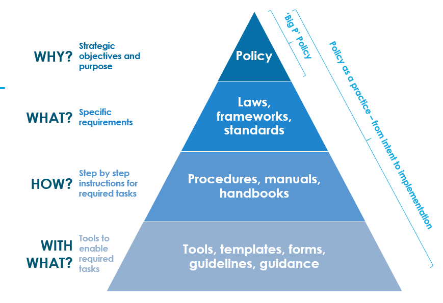

# Cyber Security - Governance, Risk and Compliance (GRC) - Australian Edition🦘
This page summarises some GRC basics, the prominent Cyber GRC frameworks used Internationally and within Australia that I have come across in my exposure during cyber roles.  This is not a comprehensive or complete list.  

**So why GRC?**
GRC enables you to apply consistent and measurable method to driving security improvement or meeting a set of recognised requirements.

**But GRC is boring!**
It's hard to argue that GRC can appear pretty boring and repetitive.  It involves lots of spreadsheets, assessments and process.  One of the best outcomes of it is seeing things improve.  Like all things it can be simplified into a lifecycle of these steps:
 1. Assess and Measure
 2. Identify gaps
 3. Develop a prioritised roadmap to address the gaps
 4. Implement

## My approach to Cyber GRC
I will not pretend to be a seasoned Cyber GRC expert, however **You may find that through my mentoring, I will bring my lens as a more IT technical person and provide my GRC context from a practitioner’s perspective. I have grown to understand GRC from the perspective of improving cyber security through a risk management approach, rather than focusing purely on compliance.** I would like to highlight COMPLIANCE does not equal SECURITY.  For example, Microsoft adheres to a lot of compliance, but they could find them in a scenario like this, where they are vulnerable (e.g.  [Cyber Safety Review Board Releases Report on Microsoft Online Exchange Incident from Summer 2023 | CISA](https://www.cisa.gov/resources-tools/resources/cyber-safety-review-board-releases-report-microsoft-online-exchange-incident-summer-2023 "https://www.cisa.gov/resources-tools/resources/cyber-safety-review-board-releases-report-microsoft-online-exchange-incident-summer-2023")).

Risk management which is core across each of these is really a management/executive decision within an entity and is really defined by the risk appetite – i.e. how much risk are they willing to take. This is a standard approach for identifying risks, understanding impact/consequences and likelihood of the risk/threat occurring/eventuating. A risk management approach would come up with a set of Treatments or Controls to reduce the risk to a tolerable level.

## Intro
An simple explanation I found on  [Cybersecurity Services : Governance, Risk and Compliance (industryrisk.com.au)](https://industryrisk.com.au/services/cybersecurity-services/ "https://industryrisk.com.au/services/cybersecurity-services/")  really captures GRC in a simple statement:

> Effective cybersecurity strategies encompass governance, risk and  compliance  **functions to guide, direct and manage people, processes and technologies.**

**Breaking down a hierarchy of GRC elements**

I tend to focus on a hierarchy of items that helps break down the components of GRC with a diagram like below (stolen from the NSW Website). GRC is very detailed and therefore can get just as technical on the detail as the actual infrastructure. Keeping in mind that Cyber security has over-laps with Information security, GRC brings together a combination of tools that enables better management of cyber security risks.

Source: [https://www.digital.nsw.gov.au/article/whats-in-a-name-deconstructing-and-defining-policy](https://www.digital.nsw.gov.au/article/whats-in-a-name-deconstructing-and-defining-policy "https://www.digital.nsw.gov.au/article/whats-in-a-name-deconstructing-and-defining-policy")

**Please note:** There are other examples of Hierarchy Diagrams of Cyber GRC components which may place them at different levels.  This is one example, not prescriptive.

**Frameworks & Cyber Security Standards**
To simplify by Industry, these are the typical Cyber Security Frameworks & Cyber Security Standards in Australia:
* **Within the context of Government Entities**, government policy is what defines cyber security expectations for these entities to adhere to (in addition to legislative requirements). 
* **In non-government**, this is often driven by legislative requirements such as Privacy Act, Security of Critical Infrastructure and tort (common) law -  [Australian Cyber Law Map | AustralianCyberLawMap | CyberLaw | AustLII Communities](https://austlii.community/wiki/CyberLaw/AustralianCyberLawMap/ "https://austlii.community/wiki/CyberLaw/AustralianCyberLawMap/")  provides some useful mapping to Australian law based on various categories.  
* Some areas of non-government may also be subject to a regulator such as Australian Prudential Regulation Authority (APRA) – which is within Finance, Insurance and Superannuation funds. [CPS 234 & CPG 234 - Information Security Prudential Standards | APRA](https://www.apra.gov.au/information-security "https://www.apra.gov.au/information-security")
* The Energy Sector is regulated by [Australian Energy Market Operator](https://aemo.com.au/), with entities being subject to the [Australian Energy Sector Cyber Security Framework (AESCSF)](https://aemo.com.au/initiatives/major-programs/cyber-security/aescsf-framework-and-resources) 

**My analogy on Cyber Frameworks is they are like the components that build a house.**

-   When you build a house, you have a set of items/components that build up the house including rooms, fittings and furnishings. Every house is unique, just like every business/environment.
-   **Rooms:** A House would require some minimum things to be functional including kitchen, bedroom, bathroom, laundry and living space. In a similar way to implement security, a framework helps define what this minimum looks like. There is nothing wrong with building greater capacity (more rooms), but this will come to a resources and space within your land.
-   **Fittings:** A kitchen is often known to have a bench, tapware, sinks, ovens etc – however each kitchen is unique on the fittings. A higher quality bench, tapware, appliances could make the kitchen more usable or provide more functionality, also keeping in mind that even a better kitchen, doesn’t mean a better meal.
-   **Furnishings:**  These are the things that move in and out of the house, in the context of cyber programs – the people. They follow processes, in the case of the kitchen, follow a recipe.

## Australian Government Landscape for Cyber Security Frameworks
The Australian Government Landscape for Cyber security Frameworks there are several in use:

- **International Frameworks and Standards**
	- [International Organization for Standization (ISO) - 27000 Series](https://www.iso.org/standard/iso-iec-27000-family) This is a family of information security standards which comprises of the requirements for Information Security Management Systems and series of controls 
	- [National Institute of Standards and Technology (NIST) Cyber Security Framework (CSF) 2.0](https://www.nist.gov/cyberframework).  The NIST Cybersecurity Framework (CSF) 2.0 can help organizations manage and reduce their cybersecurity risks as they start or improve their cybersecurity program.
	- [Cyber Security Maturity Model (C2M2)](https://www.energy.gov/ceser/cybersecurity-capability-maturity-model-c2m2) The Cybersecurity Capability Maturity Model (C2M2) is a free tool to help organizations evaluate their cybersecurity capabilities and optimize security investments. It uses a set of industry-vetted cybersecurity practices focused on both information technology (IT) and operations technology (OT) assets and environments.
	- [Payment Card Industry Data Security Standard (PCI-DSS)](https://www.pcisecuritystandards.org/standards/pci-dss/) PCI DSS was developed to encourage and enhance payment card account data security and facilitate the broad adoption of consistent data security measures globally. PCI DSS provides a baseline of technical and operational requirements designed to protect payment account data.
	- [Center for Internet Security (CIS) - The 18 CIS Critical Security Controls](https://www.cisecurity.org/controls/cis-controls-list). The CIS Critical Security Controls (CIS Controls) are a prescriptive, prioritized, and simplified set of best practices that you can use to strengthen your cybersecurity posture.
	- [Dynamic Standards International - SMB10001](https://dsi.org/smb1001). A multi-tiered cyber security certification standard for small and medium-sized businesses.  

-   **Federal Government -** [Protective Security Policy Framework](https://www.protectivesecurity.gov.au/ "https://www.protectivesecurity.gov.au/")  (PSPF) (Policy)
	- Information Security Manual (ISM) (Framework):  [Information Security Manual (ISM) | Cyber.gov.au](https://www.cyber.gov.au/resources-business-and-government/essential-cyber-security/ism "https://www.cyber.gov.au/resources-business-and-government/essential-cyber-security/ism")
	- ASD 37 -  [Strategies to Mitigate Cyber Security Incidents | Cyber.gov.au](https://www.cyber.gov.au/resources-business-and-government/essential-cyber-security/strategies-mitigate-cyber-security-incidents "https://www.cyber.gov.au/resources-business-and-government/essential-cyber-security/strategies-mitigate-cyber-security-incidents")
	- Essential 8 (Subset of ISM framework and the ASD37 – more standards driven) -  [Essential Eight | Cyber.gov.au](https://www.cyber.gov.au/resources-business-and-government/essential-cyber-security/essential-eight "https://www.cyber.gov.au/resources-business-and-government/essential-cyber-security/essential-eight")
	- [Defence Industry Security Program (DISP)](https://www.defence.gov.au/business-industry/industry-governance/industry-regulators/defence-industry-security-program) and [DSPF](https://www.defence.gov.au/business-industry/industry-governance/industry-regulators/defence-industry-security-program/resources/frequently-asked-questions) (used for Working Securely with Defence)

-   **States and Territories**
	 - **ACT**: [ACT Government Cyber Security Policy](https://www.act.gov.au/open/act-government-cyber-security-policy) and [ACT Protective Security Framework
](https://www.act.gov.au/open/act-protective-security-framework) - similar to be in line with Federal PSPF
	- **NSW**:  [Policies | Digital NSW](https://www.digital.nsw.gov.au/delivery/cyber-security/policies "https://www.digital.nsw.gov.au/delivery/cyber-security/policies")  – Follows a NIST Cyber Security Framework, with requirements for E8
	-   **QLD**:  [Information and cyber security policy (IS18)](https://www.forgov.qld.gov.au/information-and-communication-technology/cyber-security/information-security-requirements-and-responsibilities "https://www.forgov.qld.gov.au/information-and-communication-technology/cyber-security/information-security-requirements-and-responsibilities")  – Based around ISO 27000
	-  **SA**:  [Protective Security | Security SA](https://www.security.sa.gov.au/protective-security-framework "https://www.security.sa.gov.au/protective-security-framework") - similar to be in line with Federal PSPF
	- **Tasmania**: [Tasmanian Government Protective Security Policy Framework](https://www.security.tas.gov.au/protective-security) (TAS-PSPF) - similar to be in line with Federal PSPF
	- **Victoria**:   [Victorian Protective Data Security Standards V2.0](https://ovic.vic.gov.au/information-security/standards/)
	- **WA**:  [2024 WA Government Cyber Security Policy (www.wa.gov.au)](https://www.wa.gov.au/government/publications/2024-wa-government-cyber-security-policy "https://www.wa.gov.au/government/publications/2024-wa-government-cyber-security-policy")  – Follows NIST Cyber Security Framework with requirements for E8 & ASD37

## Where to start?
As there are so many GRC frameworks, It would be my recommendation to become familiar with the elements of the following Frameworks, to maximise coverage of Australian entity requirements:
-   Familiarise yourself with your State's Cyber Policy framework.
-   [Essential 8](https://www.cyber.gov.au/resources-business-and-government/essential-cyber-security/essential-eight "https://www.cyber.gov.au/resources-business-and-government/essential-cyber-security/essential-eight") &  [ASD37](https://www.cyber.gov.au/resources-business-and-government/essential-cyber-security/strategies-mitigate-cyber-security-incidents "https://www.cyber.gov.au/resources-business-and-government/essential-cyber-security/strategies-mitigate-cyber-security-incidents") – Focus on understanding the Why & What.  Don't read them page to page unless you want to dive in deeper.
-   NIST Cyber Security Framework 2.0 -  [Cybersecurity Framework | NIST](https://www.nist.gov/cyberframework "https://www.nist.gov/cyberframework") – The individual pillars Govern, Identify, Protect, Detect, Respond, Recover enable resilience to manage cyber security threats when they occur.  

	- The detail of each aspect of the Framework is broken up Categories - [Cybersecurity Framework v2.0 - CSF Tools](https://csf.tools/reference/nist-cybersecurity-framework/v2-0/ "https://csf.tools/reference/nist-cybersecurity-framework/v2-0/"). For example Supply chain security has 10 sub-categories to implement  [GV.SC: Cybersecurity Supply Chain Risk Management - CSF Tools](https://csf.tools/reference/nist-cybersecurity-framework/v2-0/gv/gv-sc/ "https://csf.tools/reference/nist-cybersecurity-framework/v2-0/gv/gv-sc/")

The best part about all the above is that they are all FREE.  
